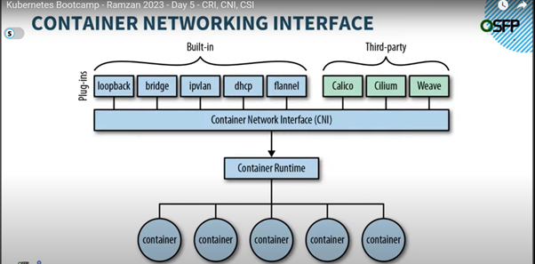
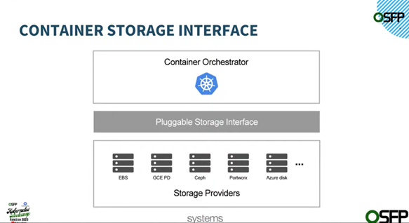

# My Kubernetes Cookbook
This cookbook is maintained to keep track of my k8s concepts learning. 

```
Outline
-------
1. Kubernetes Architecture
2. Kubernetes Objects
3. 
```

## What is Kubernetes?
Kubernetes is a portable, extensible, open source platform for managing containerized workloads and services, that facilitates both declarative configuration and automation. It has a large, rapidly growing ecosystem.

## Kubernetes Architecture 
Kubernetes consists of two type of nodes:
1. Control Plane (Master)
2. Worker Node (Slave)


### Control Plane Components
Control Plane runs following components to make it a master node: 
- Kube API Server
- ETCD (key-value datastore)
- Kube Scheduler 
- Kube Controller Manager
  - Node Controller
  - Job Controller
  - ServiceAccount Controller
  - EndpointSlice Controller

### Worker Node Components
Worker node runs following components: 
- Kubelet 
- Kube-proxy 
- Container Runtime 

## Kubernetes Objects 
Kubernetes objects are persistent entities in the Kubernetes system. Kubernetes uses these entities to represent the state of your cluster. 

Specifically, they can describe:
- What containerized applications are running (and on which nodes).
- The resources available to those applications.
- The policies around how those applications behave, such as restart policies, upgrades, and fault-tolerance.

Following are the well known objects of k8s:
- Pod
- ReplicaSet 
- Deployment 
- Service 
- StatefulSet
- DaemonSet
- Namespace 
- Ingress 
- ConfigMap
- Secret
- PersistantVolume (PV)
- PersistantVolumeClaim (PVC) 
- StorageClass


## Container Interfaces 
In this section some container interfaces are discussed. 

### Container Runtime Interface (CRI)
- Specificatrion for container runtime to communicate with Kubernetes API Server and manage containers. 
- CRI is a plugin-based system for integrating container runtimes with K8s. 
- It provides a standardized way for container runtimes to interact with K8s.
- The CRI is a plugin interface which enables the kubelet to use a wide variety of container runtimes, without having a need to recompile the cluster components.
- The Container Runtime Interface (CRI) is the main protocol for the communication between the kubelet and Container Runtime.
- CRI consists of a set of specifications and tools that define how container runtimes should work in K8s. 
- CRI plugins can be used to implement different container runtimes, such as Docker or CRI-O
- Kubernetes supports following container runtimes: 
  - Containerd
  - CRI-O
  - Docker
  - Mirantis 

### Container Network Interface (CNI)
- Specificatrion for container networking plugins to provide network capabiliteis to containers running in Kubernetes. 
- Container Network Interface (CNI) plugins for cluster networking. 
- It is reponsible for connecting Pods to the network and exposing them to other Pods and Services. 
- CNI consists of a set of specifications and tools that define how network should work in K8s. 
- CNI plugins can be used to implement different networking solutions, such as Overlay networks or Host networking. 
- Some popular CNI plugins include Calico, Flannel, and WeaveNet. 



#### Calico
- Calico is popular open-source CNI plugin for K8s ecosystem. 
- Calico is positioned for environments where factors like **network performance**, **flexibility** and **power** are essential.  
- Calico can be easily deployed as a DaemonSet on each node. 
- Each node in a cluster would have *three* Calico components installed, i.e. **Felix**, **BIRD**, and **confd** for managing network tasks. 

### Container Storage Interface (CSI)
- Specificatrion for storage plugins to dynamically provision and manage storage resources for containers running in Kubernetes. 
- CSI is a plugin-based system for integrating storage providers with K8s.
- It provides a standardized way for storage providers to interact with K8s. 
- CSI consists of a set of specifications and tools that define how storage should work in K8s.
- CSI plugins can be used to implement different storage solutions, such as Block storage or File storage.
- Some popular CSI plugins include AWS EBS, Azure Disk, and NFS. 



