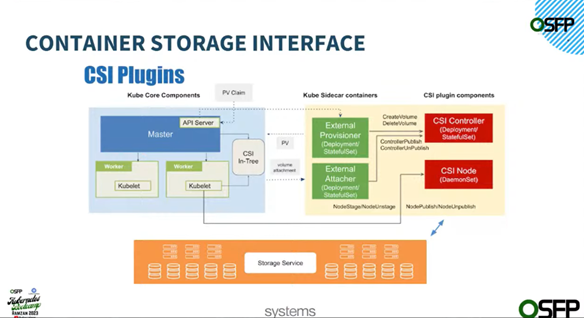
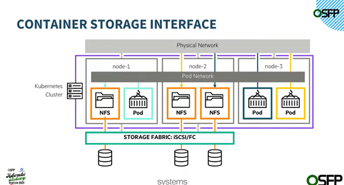
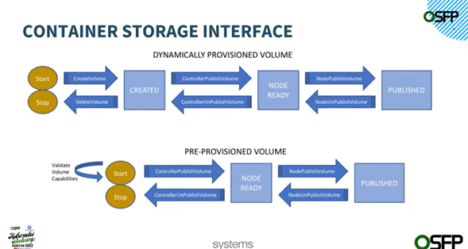
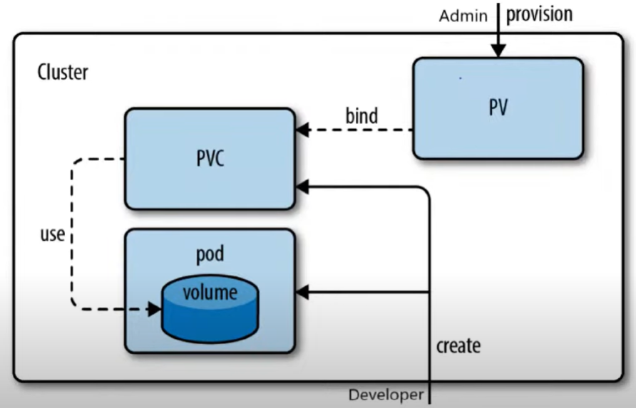
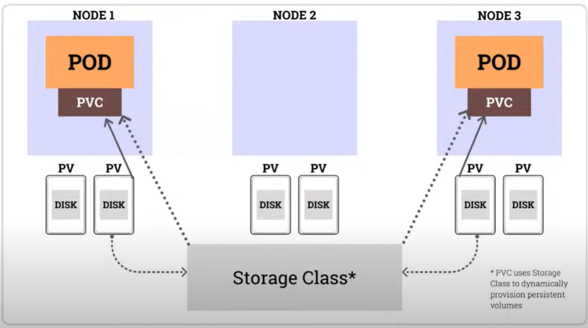
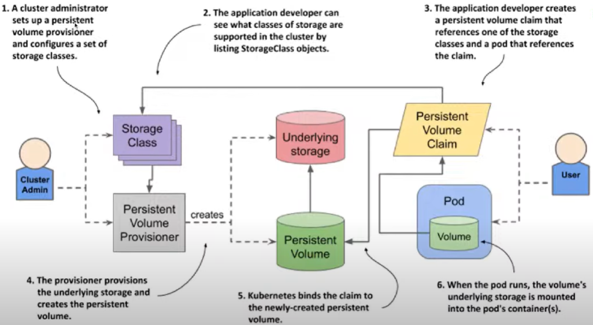

# My Kubernetes Cookbook
This cookbook is maintained to keep track of my k8s concepts learning. 

-------
**Outline**
- [What is Kubernetes?](#what-is-kubernetes)
- [Kubernetes Architecture](#kubernetes-architecture)
- [Kubernetes Objects](#kubernetes-objects)
- [Container Interfaces](#container-interfaces)
- Ingress
- [Volumes](#volumes)

-------

## What is Kubernetes?
Kubernetes is a portable, extensible, open source platform for managing containerized workloads and services, that facilitates both declarative configuration and automation. It has a large, rapidly growing ecosystem.

## Kubernetes Architecture 
Kubernetes consists of two type of nodes:
1. Control Plane (Master)
2. Worker Node (Slave)


### Control Plane Components
Control Plane runs following components to make it a master node: 
- Kube API Server
- ETCD (key-value datastore)
- Kube Scheduler 
- Kube Controller Manager
  - Node Controller
  - Job Controller
  - ServiceAccount Controller
  - EndpointSlice Controller

### Worker Node Components
Worker node runs following components: 
- Kubelet 
- Kube-proxy 
- Container Runtime 

## Kubernetes Objects 
Kubernetes objects are persistent entities in the Kubernetes system. Kubernetes uses these entities to represent the state of your cluster. 

Specifically, they can describe:
- What containerized applications are running (and on which nodes).
- The resources available to those applications.
- The policies around how those applications behave, such as restart policies, upgrades, and fault-tolerance.

Following are the well known objects of k8s:
- Pod
- ReplicaSet 
- Deployment 
- Service 
- StatefulSet
- DaemonSet
- Namespace 
- Ingress 
- ConfigMap
- Secret
- PersistantVolume (PV)
- PersistantVolumeClaim (PVC) 
- StorageClass

### Pod
Following are the important points about Pod:
- Pods are the smallest deployable units of computing that we can create and manage in Kubernetes.
- A Pod is a group of one or more containers, with shared storage and network resources, and a specification for how to run the containers. 
- A Pod's contents are always co-located and co-scheduled, and run in a shared context. 
- Pods are designed to support multiple cooperating processes (as containers) that form a cohesive unit of service. 
- The containers in a Pod are automatically co-located and co-scheduled on the same physical or virtual machine in the cluster. 
- The containers can share resources and dependencies, communicate with one another, and coordinate when and how they are terminated.

There are two type of Pods:
1. Pod (simple)
2. Static Pod 

#### Simple Pods
- Normally Pods are controlled through API Server.

#### Static Pods 
- Static Pods are managed directly by the kubelet daemon on a specific node, without the API server observing them. 
- The kubelet directly supervises each static Pod. 
- Static Pods are always bound to one Kubelet on a specific node. 
- The main use for static Pods is to run a self-hosted control plane: in other words, using the kubelet to supervise the individual control plane components.


## Container Interfaces
In this section some container interfaces are discussed. 

### Container Runtime Interface (CRI)
- Specificatrion for container runtime to communicate with Kubernetes API Server and manage containers. 
- CRI is a plugin-based system for integrating container runtimes with K8s. 
- It provides a standardized way for container runtimes to interact with K8s.
- The CRI is a plugin interface which enables the kubelet to use a wide variety of container runtimes, without having a need to recompile the cluster components.
- The Container Runtime Interface (CRI) is the main protocol for the communication between the kubelet and Container Runtime.
- CRI consists of a set of specifications and tools that define how container runtimes should work in K8s. 
- CRI plugins can be used to implement different container runtimes, such as Docker or CRI-O
- Kubernetes supports following container runtimes: 
  - Containerd
  - CRI-O
  - Docker
  - Mirantis 

### Container Network Interface (CNI)
- Specificatrion for container networking plugins to provide network capabiliteis to containers running in Kubernetes. 
- Container Network Interface (CNI) plugins for cluster networking. 
- It is reponsible for connecting Pods to the network and exposing them to other Pods and Services. 
- CNI consists of a set of specifications and tools that define how network should work in K8s. 
- CNI plugins can be used to implement different networking solutions, such as Overlay networks or Host networking. 
- Some popular CNI plugins include Calico, Flannel, and WeaveNet. 


#### Calico
- Calico is popular open-source CNI plugin for K8s ecosystem. 
- Calico is positioned for environments where factors like **network performance**, **flexibility** and **power** are essential.  
- Calico can be easily deployed as a DaemonSet on each node. 
- Each node in a cluster would have *three* Calico components installed, i.e. **Felix**, **BIRD**, and **confd** for managing network tasks. 

### Container Storage Interface (CSI)
- Specificatrion for storage plugins to dynamically provision and manage storage resources for containers running in Kubernetes. 
- CSI is a plugin-based system for integrating storage providers with K8s.
- It provides a standardized way for storage providers to interact with K8s. 
- CSI consists of a set of specifications and tools that define how storage should work in K8s.
- CSI plugins can be used to implement different storage solutions, such as Block storage or File storage.
- Some popular CSI plugins include AWS EBS, Azure Disk, and NFS. 


[Image Source](https://www.youtube.com/live/s-dH7Ktz1Zc)



[Image Source](https://www.youtube.com/live/s-dH7Ktz1Zc)



[Image Source](https://www.youtube.com/live/s-dH7Ktz1Zc)



[Image Source](https://www.youtube.com/live/s-dH7Ktz1Zc)

## Volumes
In Kubernetes, a volume is a directory that is accessible to containers in a Pod. Volumes are used to store data that needs to persist beyond the lifetime of a container or to share data between containers. They are created by the kubelet on the node where the Pod is running, and can be backed by various storage types, such as local disk, network storage, or cloud storage.

Volumes can be used in several ways in Kubernetes, including:
- To store application data that needs to persist beyond the lifetime of a container, such as a database or configuration files.
- To share data between containers in a Pod, for example, when multiple containers need to access the same files.
- To provide a way to inject configuration data into a container at runtime, without requiring the container to be rebuilt.

Kubernetes supports several types of volumes, including:
- **emptyDir:** A volume that is created when a Pod is created and exists as long as the Pod exists. Data in this volume is lost if the Pod is deleted or recreated.
- **hostPath:** A volume that mounts a file or directory from the host node's filesystem into the Pod. This can be used to access host-level resources such as logs or configuration files.
- **persistentVolumeClaim:** A volume that is backed by a persistent volume, which is a piece of network-attached storage provisioned by the cluster's administrator. This type of volume is used to store data that needs to persist beyond the lifetime of a Pod, such as a database.
- **configMap:** A volume that exposes a configuration file or set of key-value pairs as a volume in a Pod. This can be used to provide configuration data to a container at runtime.

Volumes are a key component of Kubernetes, and are used extensively in building scalable and resilient applications.


### Persistent Volume Claims (PVCs)
In Kubernetes, a Persistent Volume Claim (PVC) is a request for storage by a user. A PVC is used to request a specific amount of storage space from a Persistent Volume (PV) in a storage class. A PV is a piece of storage in the cluster that has been provisioned by an administrator or dynamically provisioned using a Storage Class.

When a user requests storage through a PVC, Kubernetes automatically creates a PV that matches the storage requirements of the PVC, or binds the PVC to an existing PV that meets the requirements. Once the PVC is bound to a PV, the user can use it to store data.

PVCs decouple the storage volume from the Pod that uses it, allowing administrators to manage the underlying storage independently of the Pods that use it. This enables more efficient use of storage resources, as multiple Pods can share the same PV, and makes it easier to migrate Pods between nodes without disrupting their storage.

Overall, Persistent Volume Claims help simplify storage management in Kubernetes by providing a way for users to request and use storage resources in a more abstract way, without having to worry about the underlying details of how the storage is managed.

Some key points include:
- Persistent Volume Claims (PVCs) are requests for a
specific type of Persistent Volume (PV).
- They act as an abstraction layer between Pods and PVs.
- PVCs allow users to consume PVs without having to know the implementation details.
- PVCs can request a specific amount of storage and access modes.
- They can be created dynamically by the Kubernetes API Server or manually by an administrator.
- PVCs can be bound to a single PV at a time, but a single PV can be bound to multiple PVCs.
- PVCs can be used by one or more Pods to store data persistently.

#### Persistent Volume Claims - Example for NFS

```
apiVersion: v1
kind: PersistentVolumeClaim
metadata:
  name: myclaim
spec:
  accessModes:
    - ReadWriteOnce
  volumeMode: Filesystem
  resources:
    requests:
      storage: 8Gi
  storageClassName: slow
  selector:
    matchLabels:
      release: "stable".
    matchExpressions:
      {key: environment, operator: In, values: [dev]}
```







### Persistent Volumes (PVs)
In Kubernetes, a Persistent Volume (PV) is a piece of storage in the cluster that has been provisioned by an administrator or dynamically provisioned using a StorageClass. It is a way to abstract the details of the underlying storage system, providing a uniform interface for applications to request storage resources.

Persistent Volumes can be used by applications running in pods to store data persistently across pod restarts and rescheduling. When an application requests storage resources, it can be bound to a Persistent Volume Claim (PVC) which requests storage of a particular size and access mode. If a suitable Persistent Volume is available, the PVC is bound to it, and the application can start using it. If no suitable Persistent Volume is available, Kubernetes can dynamically provision one using a StorageClass.

Some key points include:
- Persistent Volumes (PVs) in K8s provide a way to store data separately from Pods.
- It is a piece of storage in the cluster that has been
provisioned by an administrator or dynamically
provisioned using a storage class.
- PVs have a lifecycle independent of pods and are not tied
to any specific pod.
- Can be statically provisioned or dynamically provisioned.
- Can be accessed by one or many pods simultaneously
depending on the access mode specified.
- PVs are available in different types, such as local,
network-attached, and cloud-provider-specific.
- PVs can be bound to Persistent Volume Claims (PVCs) to
provide storage to pods.

#### Importance of PVs and PVCs in K8s
- PVs and PVCs provide a way to abstract storage from underlying physical or cloud-based storage
infrastructure.
- They help to decouple storage from pod or container creation, which means that storage can be
managed independently from the applications.
- With PVs and PVCs, storage can be dynamically provisioned or allocated on demand.
- They help to ensure data availability and persistence across pod or container failures, node failures, and
cluster upgrades or migrations.
- PVs and PVCs provide a way to manage storage resources efficiently, including monitoring, utilization,
and optimization.
- They enable multi-tenancy and secure isolation of storage resources, providing more granular control
over storage access and usage.
- Facilitates data persistence in stateful applications.

#### Persistent Volume Types 
Following are some Persistent Volume types. 

| Type | Description    |
|------|----------------|
| HostPath | PV is mapped to a file or directory on the host node. Can be used for testing or situations where data persistence is not required. |
| NFS | Network File System (NFS) is used to store data on network-attached storage devices. Multiple pods can access the same volume. |
| iSCSI | iSCSI is a protocol used for block-level data storage, often used in storage area networks (SANS). Provides high-performance storage and can be used in production environments. |
| Cinder | Cinder is a block storage system used by OpenStack for managing and providing persistent storage to VMs. |
| GlusterFS | A distributed file system that can scale out to multiple nodes. Provides scalable and fault-tolerant storage and can be used for big data and high-performance computing workloads. |

#### Persistent Volume - Example for NFS

```
apiVersion: v1
kind: PersistentVolume
metadata:
  name: pv0003
spec:
  capacity:
    storage: 5Gi
  volumeMode: Filesystem
  accessModes:
    - ReadWriteOnce
  persistentVolumeReclaimPolicy: Recycle
  storageClassName: slow
  mountOptions:
    - hard
    - nfsvers=4.1
  nfs:
    path: /tmp
    server: 172.17.0.2
```

#### Volume Modes
Volume Modes specify how a volume can be accessed by containers in a pod.

There are two volume modes available in Persistent Volumes:
1. **Filesystem Mode**:
    - Used to mount the volume as a directory to the container
    - The volume is mounted as a directory and the data is stored as files.
    - Used for applications that require file storage.
2. **Block Mode**:
    - Used to mount the volume as a block device to the container.
    - The volume is mounted as a block device and the data is stored as blocks.
    - Used for applications that require raw storage.

Defined in Persistent Volume configuration file

**It is important to choose the appropriate volume mode for your application because it affects the way the storage is accessed and used.**

#### Access Modes
Access modes determine how a volume can be mounted by pods
There are three types of access modes:
1. **ReadWriteOnce (RWO)**:
    - Allows the volume to be mounted as read-write by a single node in the cluster.
2. **ReadOnlyMany (ROX)**:
    - Allows the volume to be mounted as read-only by multiple nodes in the cluster.
3. **ReadWriteMany (RWX)**:
    - Allows the volume to be mounted as read-write by multiple nodes in the cluster simultaneously.

Defined in Persistent Volume and Persistent Volume Claim configuration file

**It's important to choose the appropriate mode to ensure proper functionality of the application.**

#### Reclaim Plicy 
Reclaim policy determines what happens to the PV when it is released or deleted from a K8s cluster.

There are three reclaim policies that can be set:
1. **Retain**:
    - The PV is not deleted when it's released or deleted from the cluster
    - It remains available for manual reclamation
    - Useful for preserving data for further analysis or debugging.
2. **Recycle**:
    - The PV is deleted, and its contents are wiped clean when it's released or deleted from the cluster
    - The volume is made available for a new claim.
    - Useful for non-critical data or when the data needs to be wiped clean before reuse.
3. **Delete**:
    - The PV is deleted from the storage provider when it's released or deleted from the cluster.
    - Useful when the data stored in the PV is no longer needed
    - The storage resource can be reclaimed by the provider.

### Storage Class 
In Kubernetes, a StorageClass is an object that defines the class of storage that will be used by the PersistentVolumeClaim (PVC) object to dynamically provision the PersistentVolume (PV) resources. In other words, a StorageClass provides a way for administrators to define different classes of storage with different performance characteristics, and for users to request the type of storage they need.

A StorageClass can specify parameters such as the type of storage (e.g., block or file), the performance characteristics (e.g., fast or slow), the availability and durability requirements, and so on. When a user creates a PVC, they can request a specific StorageClass by name, and Kubernetes will dynamically provision a PV that matches the class requirements if one is available.

Using StorageClasses allows administrators to manage storage resources more efficiently, by offering a way to automate the provisioning of PVs based on the requirements of the PVCs, and to offer different classes of storage to users with different needs.

Some key points include:
- A kubernetes object that defines the class of storage.
- Determines the properties of the Persistent Volume.
- Allows dynamic provisioning of storage resources.
- Allows administrators to define multiple storge classes. 
- Enablles applications to request the desired storage class.
- Simplifiles storage managment in a cluster environment.
- Some of the storage classes are: AWS EBS, Azure Disk, Google Cloud Persistent Disk, NFS, GlusterFS, Ceph RBD, OpenEBS, Local storage. 

#### Storage Class - Example

```
apiVersion: storage.k8s.io/v1
kind: StorageClass
metadata:
  name: slow
provisioner: external-nfs
reclaimPolicy: Recycle
allowVolumeExpansion: true
volumeBindingMode: Immediate
mountOptions:
  - hard
  - nfsvers=4.1
parameters:
  nfsServer: "172.17.0.2"
  nfsPath: "/tmp"
```

### NFS as Persistent Volume

#### Using NFS as Persistent Volume - Steps 
- Install NFS server and create a NFS share
- CSI driver installation for NFS
- Create a Storage Class YAML file 
- Create a Persistent Volume Claim YAML file

**Install NFS Package on NFS Server**

- Run the following command on the server that needs to be created as NFS server
  - sudo apt-get install nfs-kernel-server
- Create a directory to be used for sharing
  - `sudo mkdir -p <path>`
  - `sudo chown nobody:nogroup <path>`
  - `sudo chmod 0777 <path>`
- Edit the `/etc/exports` file, and make sure the nodes can access the NFS
  - `<path> <CIDR>(rw,sync,no_subtree_check)`
  - `/sharing/nfs 10.0.0.0/28(rw,sync,no_subtree_check)`
- Restart the NFS Server
  - `sudo systemctl restart nfs-kernel-server`

**CSI driver installation for NFS**

- Enable helm3 addon
  - `microk8s enable helm3`
- Deploy NFS provisioner using the official helm chart
  - `microk8s helm3 repo add csi-driver-nfs https://raw.githubusercontent.com/kubernetes-csi/csi-driver-nfs/master/charts`
  - `microk8s helm3 repo update`
- Install the helm chart under the kube-system namespace
  - `microk8s helm3 install csi-driver-nfs csi-driver-nfs/csi-driver-nfs --namespace kube-system --set kubeletDir=/var/snap/microk8s/common/var/lib/kubelet`
- After deploying the Helm chart, wait for the CSI controller and node pods to come up
  - `microk8s kubectl wait pod --selector app.kubernetes.io/name=csi-driver-nfs --for condition=ready --namespace kube-system`
- List the available CSI drivers in your Kubernetes
  - `microk8s kubectl get csidrivers`

**Create a Storage Class YAML file** 

```
apiVersion: storage.k8s.io/v1
kind: StorageClass
metadata:
  name: nfs-csi
provisioner: nfs.csi.k8s.io
parameters:
  server: 10.0.0.42
  share: /srv/nfs
reclaimPolicy: Delete
volumeBindingMode: Immediate
mountOptions:
  - hard
  - nfsvers=4.1
```

**Create a New Persistent Volume Claim (PVC)**

```
apiVersion: v1
kind: PersistentVolumeClaim
metadata:
  name: my-pvc
spec:
  storageClassName: nfs-csi
  accessModes: [ReadWriteOnce]
  resources:
    requests:
      storage: 5Gi
```

## Role-based access control (RBAC)
Role-based access control (RBAC) is a method of regulating/controlling access to computer or network resources based on the roles of individual users within the organization.

Few keypoints are: 
- It allows us to define granular permissions for users or group of users. 
- Limit the access of users to specific resources or actions within the cluster. 
- Ensure that only authorized user or processes can access or midify certain resources in a Kubernetes cluster. 
- Enhance security and reduce the risk of unauthorized access or attacks. 
- Particularly useful in multi-tenant environments. 
 
RBAC authorization uses the `rbac.authorization.k8s.io` API group to drive authorization decisions, allowing us to dynamically configure policies through the Kubernetes API.

To enable RBAC, start the API server with the `--authorization-mode` flag set to a comma-separated list that includes `RBAC;` for example:

`kube-apiserver --authorization-mode=Example,RBAC --other-options --more-options`

### API Objects 
The RBAC API declares four kinds of Kubernetes objects: 
1. **Roles:** A set of rules that define the permissions of a specific role within a namespace. 
2. **ClusterRoles:** A set of rules that define the permissions of a role across the entire cluster. 
3. **RoleBindings:** A mapping of a role to a set of users or groups within a namespace. 
4. **ClusterRoleBindings:** A mapping of a cluster role to a set of users or groups across the entire cluster. 

#### Role and ClusterRole
An RBAC **_Role_** or **_ClusterRole_** contains rules that represent a set of permissions. 

A Role always sets permissions within a particular namespace; when we create a Role, we have to specify the namespace it belongs in. 

ClusterRole, by contrast, is a non-namespaced resource. The resources have different names (Role and ClusterRole) because a Kubernetes object always has to be either namespaced or not namespaced; it can't be both.

ClusterRoles have several uses. You can use a ClusterRole to:
- define permissions on namespaced resources and be granted access within individual namespace(s)
- define permissions on namespaced resources and be granted access across all namespaces
- define permissions on cluster-scoped resources

**Note:** If you want to define a role within a namespace, use a Role; if you want to define a role cluster-wide, use a ClusterRole.

#### RoleBinding and ClusterRoleBinding
A role binding grants the permissions defined in a role to a user or set of users. It holds a list of subjects (users, groups, or service accounts), and a reference to the role being granted. A RoleBinding grants permissions within a specific namespace whereas a ClusterRoleBinding grants that access cluster-wide.

A RoleBinding may reference any Role in the same namespace. Alternatively, a RoleBinding can reference a ClusterRole and bind that ClusterRole to the namespace of the RoleBinding. If we want to bind a ClusterRole to all the namespaces in our cluster, we use a ClusterRoleBinding.

### How RBAC Works?
- Kubernetes API Server receives requests from clients.
- The API server uses the RBAC authorization mode to check the request against policies defined in K8s objects. 
- Policies are defined in roles, role bindings, cluster roles, and cluster role bindings. 
- RBAC is enforced at the API server level and can be extended to other K8s components. 
- The cluster admin creates roles and role bindings to grant permissions. 
- A user can have multiple roles across multiple namespaces.
- Service accounts are used to manage permissions for applications running in a Pod. 
- Service accounts have a unique identity and are created automatically by K8s. 
- RBAC can be used  with external identity providers like Lightweight Directory Access Protocol (LDAP) and OpenID Connect. 
