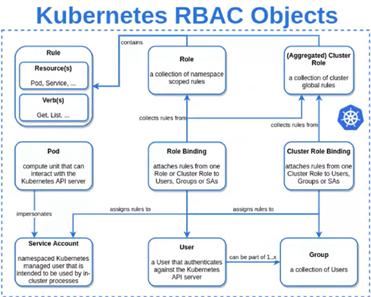
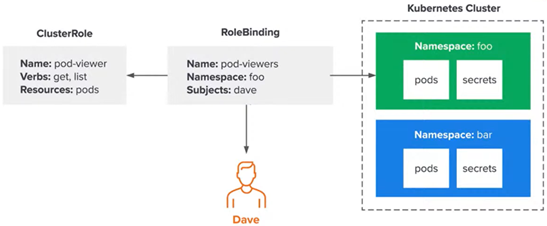
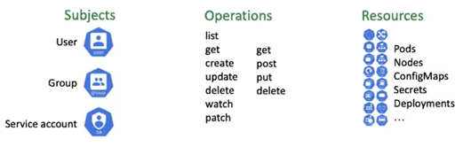

# My Kubernetes Cookbook
This cookbook is maintained to keep track of my k8s concepts learning. 

-------
**Outline**
- [What is Kubernetes?](#what-is-kubernetes)
- [Kubernetes Architecture](#kubernetes-architecture)
- [Kubernetes Objects](#kubernetes-objects)
- [Container Interfaces](#container-interfaces)
- Ingress
- [Volumes](#volumes)
- [Role-based access control (RBAC)](#role-based-access-control-rbac)
- [RBAC - Lab Tasks](#rbac-lab-tasks)
- [Helm Chart](#helm-chart)

-------

## What is Kubernetes?
Kubernetes is a portable, extensible, open source platform for managing containerized workloads and services, that facilitates both declarative configuration and automation. It has a large, rapidly growing ecosystem.

## Kubernetes Architecture 
Kubernetes consists of two type of nodes:
1. Control Plane (Master)
2. Worker Node (Slave)


### Control Plane Components
Control Plane runs following components to make it a master node: 
- Kube API Server
- ETCD (key-value datastore)
- Kube Scheduler 
- Kube Controller Manager
  - Node Controller
  - Job Controller
  - ServiceAccount Controller
  - EndpointSlice Controller

### Worker Node Components
Worker node runs following components: 
- Kubelet 
- Kube-proxy 
- Container Runtime 

## Kubernetes Objects 
Kubernetes objects are persistent entities in the Kubernetes system. Kubernetes uses these entities to represent the state of your cluster. 

Specifically, they can describe:
- What containerized applications are running (and on which nodes).
- The resources available to those applications.
- The policies around how those applications behave, such as restart policies, upgrades, and fault-tolerance.

Following are the well known objects of k8s:
- Pod
- ReplicaSet 
- Deployment 
- Service 
- StatefulSet
- DaemonSet
- Namespace 
- Ingress 
- ConfigMap
- Secret
- PersistantVolume (PV)
- PersistantVolumeClaim (PVC) 
- StorageClass

### Pod
Following are the important points about Pod:
- Pods are the smallest deployable units of computing that we can create and manage in Kubernetes.
- A Pod is a group of one or more containers, with shared storage and network resources, and a specification for how to run the containers. 
- A Pod's contents are always co-located and co-scheduled, and run in a shared context. 
- Pods are designed to support multiple cooperating processes (as containers) that form a cohesive unit of service. 
- The containers in a Pod are automatically co-located and co-scheduled on the same physical or virtual machine in the cluster. 
- The containers can share resources and dependencies, communicate with one another, and coordinate when and how they are terminated.

There are two type of Pods:
1. Pod (simple)
2. Static Pod 

#### Simple Pods
- Normally Pods are controlled through API Server.

#### Static Pods 
- Static Pods are managed directly by the kubelet daemon on a specific node, without the API server observing them. 
- The kubelet directly supervises each static Pod. 
- Static Pods are always bound to one Kubelet on a specific node. 
- The main use for static Pods is to run a self-hosted control plane: in other words, using the kubelet to supervise the individual control plane components.


## Container Interfaces
In this section some container interfaces are discussed. 

### Container Runtime Interface (CRI)
- Specificatrion for container runtime to communicate with Kubernetes API Server and manage containers. 
- CRI is a plugin-based system for integrating container runtimes with K8s. 
- It provides a standardized way for container runtimes to interact with K8s.
- The CRI is a plugin interface which enables the kubelet to use a wide variety of container runtimes, without having a need to recompile the cluster components.
- The Container Runtime Interface (CRI) is the main protocol for the communication between the kubelet and Container Runtime.
- CRI consists of a set of specifications and tools that define how container runtimes should work in K8s. 
- CRI plugins can be used to implement different container runtimes, such as Docker or CRI-O
- Kubernetes supports following container runtimes: 
  - Containerd
  - CRI-O
  - Docker
  - Mirantis 

### Container Network Interface (CNI)
- Specificatrion for container networking plugins to provide network capabiliteis to containers running in Kubernetes. 
- Container Network Interface (CNI) plugins for cluster networking. 
- It is reponsible for connecting Pods to the network and exposing them to other Pods and Services. 
- CNI consists of a set of specifications and tools that define how network should work in K8s. 
- CNI plugins can be used to implement different networking solutions, such as Overlay networks or Host networking. 
- Some popular CNI plugins include Calico, Flannel, and WeaveNet. 


#### Calico
- Calico is popular open-source CNI plugin for K8s ecosystem. 
- Calico is positioned for environments where factors like **network performance**, **flexibility** and **power** are essential.  
- Calico can be easily deployed as a DaemonSet on each node. 
- Each node in a cluster would have *three* Calico components installed, i.e. **Felix**, **BIRD**, and **confd** for managing network tasks. 

### Container Storage Interface (CSI)
- Specificatrion for storage plugins to dynamically provision and manage storage resources for containers running in Kubernetes. 
- CSI is a plugin-based system for integrating storage providers with K8s.
- It provides a standardized way for storage providers to interact with K8s. 
- CSI consists of a set of specifications and tools that define how storage should work in K8s.
- CSI plugins can be used to implement different storage solutions, such as Block storage or File storage.
- Some popular CSI plugins include AWS EBS, Azure Disk, and NFS. 


[Image Source](https://www.youtube.com/live/s-dH7Ktz1Zc)


[Image Source](https://www.youtube.com/live/s-dH7Ktz1Zc)


[Image Source](https://www.youtube.com/live/s-dH7Ktz1Zc)


[Image Source](https://www.youtube.com/live/s-dH7Ktz1Zc)

## Volumes
In Kubernetes, a volume is a directory that is accessible to containers in a Pod. Volumes are used to store data that needs to persist beyond the lifetime of a container or to share data between containers. They are created by the kubelet on the node where the Pod is running, and can be backed by various storage types, such as local disk, network storage, or cloud storage.

Volumes can be used in several ways in Kubernetes, including:
- To store application data that needs to persist beyond the lifetime of a container, such as a database or configuration files.
- To share data between containers in a Pod, for example, when multiple containers need to access the same files.
- To provide a way to inject configuration data into a container at runtime, without requiring the container to be rebuilt.

Kubernetes supports several types of volumes, including:
- **emptyDir:** A volume that is created when a Pod is created and exists as long as the Pod exists. Data in this volume is lost if the Pod is deleted or recreated.
- **hostPath:** A volume that mounts a file or directory from the host node's filesystem into the Pod. This can be used to access host-level resources such as logs or configuration files.
- **persistentVolumeClaim:** A volume that is backed by a persistent volume, which is a piece of network-attached storage provisioned by the cluster's administrator. This type of volume is used to store data that needs to persist beyond the lifetime of a Pod, such as a database.
- **configMap:** A volume that exposes a configuration file or set of key-value pairs as a volume in a Pod. This can be used to provide configuration data to a container at runtime.

Volumes are a key component of Kubernetes, and are used extensively in building scalable and resilient applications.


### Persistent Volume Claims (PVCs)
In Kubernetes, a Persistent Volume Claim (PVC) is a request for storage by a user. A PVC is used to request a specific amount of storage space from a Persistent Volume (PV) in a storage class. A PV is a piece of storage in the cluster that has been provisioned by an administrator or dynamically provisioned using a Storage Class.

When a user requests storage through a PVC, Kubernetes automatically creates a PV that matches the storage requirements of the PVC, or binds the PVC to an existing PV that meets the requirements. Once the PVC is bound to a PV, the user can use it to store data.

PVCs decouple the storage volume from the Pod that uses it, allowing administrators to manage the underlying storage independently of the Pods that use it. This enables more efficient use of storage resources, as multiple Pods can share the same PV, and makes it easier to migrate Pods between nodes without disrupting their storage.

Overall, Persistent Volume Claims help simplify storage management in Kubernetes by providing a way for users to request and use storage resources in a more abstract way, without having to worry about the underlying details of how the storage is managed.

Some key points include:
- Persistent Volume Claims (PVCs) are requests for a
specific type of Persistent Volume (PV).
- They act as an abstraction layer between Pods and PVs.
- PVCs allow users to consume PVs without having to know the implementation details.
- PVCs can request a specific amount of storage and access modes.
- They can be created dynamically by the Kubernetes API Server or manually by an administrator.
- PVCs can be bound to a single PV at a time, but a single PV can be bound to multiple PVCs.
- PVCs can be used by one or more Pods to store data persistently.

#### Persistent Volume Claims - Example for NFS

```
apiVersion: v1
kind: PersistentVolumeClaim
metadata:
  name: myclaim
spec:
  accessModes:
    - ReadWriteOnce
  volumeMode: Filesystem
  resources:
    requests:
      storage: 8Gi
  storageClassName: slow
  selector:
    matchLabels:
      release: "stable".
    matchExpressions:
      {key: environment, operator: In, values: [dev]}
```


### Persistent Volumes (PVs)
In Kubernetes, a Persistent Volume (PV) is a piece of storage in the cluster that has been provisioned by an administrator or dynamically provisioned using a StorageClass. It is a way to abstract the details of the underlying storage system, providing a uniform interface for applications to request storage resources.

Persistent Volumes can be used by applications running in pods to store data persistently across pod restarts and rescheduling. When an application requests storage resources, it can be bound to a Persistent Volume Claim (PVC) which requests storage of a particular size and access mode. If a suitable Persistent Volume is available, the PVC is bound to it, and the application can start using it. If no suitable Persistent Volume is available, Kubernetes can dynamically provision one using a StorageClass.

Some key points include:
- Persistent Volumes (PVs) in K8s provide a way to store data separately from Pods.
- It is a piece of storage in the cluster that has been
provisioned by an administrator or dynamically
provisioned using a storage class.
- PVs have a lifecycle independent of pods and are not tied
to any specific pod.
- Can be statically provisioned or dynamically provisioned.
- Can be accessed by one or many pods simultaneously
depending on the access mode specified.
- PVs are available in different types, such as local,
network-attached, and cloud-provider-specific.
- PVs can be bound to Persistent Volume Claims (PVCs) to
provide storage to pods.

#### Importance of PVs and PVCs in K8s
- PVs and PVCs provide a way to abstract storage from underlying physical or cloud-based storage
infrastructure.
- They help to decouple storage from pod or container creation, which means that storage can be
managed independently from the applications.
- With PVs and PVCs, storage can be dynamically provisioned or allocated on demand.
- They help to ensure data availability and persistence across pod or container failures, node failures, and
cluster upgrades or migrations.
- PVs and PVCs provide a way to manage storage resources efficiently, including monitoring, utilization,
and optimization.
- They enable multi-tenancy and secure isolation of storage resources, providing more granular control
over storage access and usage.
- Facilitates data persistence in stateful applications.

#### Persistent Volume Types 
Following are some Persistent Volume types. 

| Type | Description    |
|------|----------------|
| HostPath | PV is mapped to a file or directory on the host node. Can be used for testing or situations where data persistence is not required. |
| NFS | Network File System (NFS) is used to store data on network-attached storage devices. Multiple pods can access the same volume. |
| iSCSI | iSCSI is a protocol used for block-level data storage, often used in storage area networks (SANS). Provides high-performance storage and can be used in production environments. |
| Cinder | Cinder is a block storage system used by OpenStack for managing and providing persistent storage to VMs. |
| GlusterFS | A distributed file system that can scale out to multiple nodes. Provides scalable and fault-tolerant storage and can be used for big data and high-performance computing workloads. |

#### Persistent Volume - Example for NFS

```
apiVersion: v1
kind: PersistentVolume
metadata:
  name: pv0003
spec:
  capacity:
    storage: 5Gi
  volumeMode: Filesystem
  accessModes:
    - ReadWriteOnce
  persistentVolumeReclaimPolicy: Recycle
  storageClassName: slow
  mountOptions:
    - hard
    - nfsvers=4.1
  nfs:
    path: /tmp
    server: 172.17.0.2
```

#### Volume Modes
Volume Modes specify how a volume can be accessed by containers in a pod.

There are two volume modes available in Persistent Volumes:
1. **Filesystem Mode**:
    - Used to mount the volume as a directory to the container
    - The volume is mounted as a directory and the data is stored as files.
    - Used for applications that require file storage.
2. **Block Mode**:
    - Used to mount the volume as a block device to the container.
    - The volume is mounted as a block device and the data is stored as blocks.
    - Used for applications that require raw storage.

Defined in Persistent Volume configuration file

**It is important to choose the appropriate volume mode for your application because it affects the way the storage is accessed and used.**

#### Access Modes
Access modes determine how a volume can be mounted by pods
There are three types of access modes:
1. **ReadWriteOnce (RWO)**:
    - Allows the volume to be mounted as read-write by a single node in the cluster.
2. **ReadOnlyMany (ROX)**:
    - Allows the volume to be mounted as read-only by multiple nodes in the cluster.
3. **ReadWriteMany (RWX)**:
    - Allows the volume to be mounted as read-write by multiple nodes in the cluster simultaneously.

Defined in Persistent Volume and Persistent Volume Claim configuration file

**It's important to choose the appropriate mode to ensure proper functionality of the application.**

#### Reclaim Plicy 
Reclaim policy determines what happens to the PV when it is released or deleted from a K8s cluster.

There are three reclaim policies that can be set:
1. **Retain**:
    - The PV is not deleted when it's released or deleted from the cluster
    - It remains available for manual reclamation
    - Useful for preserving data for further analysis or debugging.
2. **Recycle**:
    - The PV is deleted, and its contents are wiped clean when it's released or deleted from the cluster
    - The volume is made available for a new claim.
    - Useful for non-critical data or when the data needs to be wiped clean before reuse.
3. **Delete**:
    - The PV is deleted from the storage provider when it's released or deleted from the cluster.
    - Useful when the data stored in the PV is no longer needed
    - The storage resource can be reclaimed by the provider.

### Storage Class 
In Kubernetes, a StorageClass is an object that defines the class of storage that will be used by the PersistentVolumeClaim (PVC) object to dynamically provision the PersistentVolume (PV) resources. In other words, a StorageClass provides a way for administrators to define different classes of storage with different performance characteristics, and for users to request the type of storage they need.

A StorageClass can specify parameters such as the type of storage (e.g., block or file), the performance characteristics (e.g., fast or slow), the availability and durability requirements, and so on. When a user creates a PVC, they can request a specific StorageClass by name, and Kubernetes will dynamically provision a PV that matches the class requirements if one is available.

Using StorageClasses allows administrators to manage storage resources more efficiently, by offering a way to automate the provisioning of PVs based on the requirements of the PVCs, and to offer different classes of storage to users with different needs.

Some key points include:
- A kubernetes object that defines the class of storage.
- Determines the properties of the Persistent Volume.
- Allows dynamic provisioning of storage resources.
- Allows administrators to define multiple storge classes. 
- Enablles applications to request the desired storage class.
- Simplifiles storage managment in a cluster environment.
- Some of the storage classes are: AWS EBS, Azure Disk, Google Cloud Persistent Disk, NFS, GlusterFS, Ceph RBD, OpenEBS, Local storage. 

#### Storage Class - Example

```
apiVersion: storage.k8s.io/v1
kind: StorageClass
metadata:
  name: slow
provisioner: external-nfs
reclaimPolicy: Recycle
allowVolumeExpansion: true
volumeBindingMode: Immediate
mountOptions:
  - hard
  - nfsvers=4.1
parameters:
  nfsServer: "172.17.0.2"
  nfsPath: "/tmp"
```

### NFS as Persistent Volume

#### Using NFS as Persistent Volume - Steps 
- Install NFS server and create a NFS share
- CSI driver installation for NFS
- Create a Storage Class YAML file 
- Create a Persistent Volume Claim YAML file

**Install NFS Package on NFS Server**

- Run the following command on the server that needs to be created as NFS server
  - sudo apt-get install nfs-kernel-server
- Create a directory to be used for sharing
  - `sudo mkdir -p <path>`
  - `sudo chown nobody:nogroup <path>`
  - `sudo chmod 0777 <path>`
- Edit the `/etc/exports` file, and make sure the nodes can access the NFS
  - `<path> <CIDR>(rw,sync,no_subtree_check)`
  - `/sharing/nfs 10.0.0.0/28(rw,sync,no_subtree_check)`
- Restart the NFS Server
  - `sudo systemctl restart nfs-kernel-server`

**CSI driver installation for NFS**

- Enable helm3 addon
  - `microk8s enable helm3`
- Deploy NFS provisioner using the official helm chart
  - `microk8s helm3 repo add csi-driver-nfs https://raw.githubusercontent.com/kubernetes-csi/csi-driver-nfs/master/charts`
  - `microk8s helm3 repo update`
- Install the helm chart under the kube-system namespace
  - `microk8s helm3 install csi-driver-nfs csi-driver-nfs/csi-driver-nfs --namespace kube-system --set kubeletDir=/var/snap/microk8s/common/var/lib/kubelet`
- After deploying the Helm chart, wait for the CSI controller and node pods to come up
  - `microk8s kubectl wait pod --selector app.kubernetes.io/name=csi-driver-nfs --for condition=ready --namespace kube-system`
- List the available CSI drivers in your Kubernetes
  - `microk8s kubectl get csidrivers`

**Create a Storage Class YAML file** 

```
apiVersion: storage.k8s.io/v1
kind: StorageClass
metadata:
  name: nfs-csi
provisioner: nfs.csi.k8s.io
parameters:
  server: 10.0.0.42
  share: /srv/nfs
reclaimPolicy: Delete
volumeBindingMode: Immediate
mountOptions:
  - hard
  - nfsvers=4.1
```

**Create a New Persistent Volume Claim (PVC)**

```
apiVersion: v1
kind: PersistentVolumeClaim
metadata:
  name: my-pvc
spec:
  storageClassName: nfs-csi
  accessModes: [ReadWriteOnce]
  resources:
    requests:
      storage: 5Gi
```

## Role-based access control (RBAC)
Role-based access control (RBAC) is a method of regulating/controlling access to computer or network resources based on the roles of individual users within the organization.

Few keypoints are: 
- It allows us to define granular permissions for users or group of users. 
- Limit the access of users to specific resources or actions within the cluster. 
- Ensure that only authorized user or processes can access or midify certain resources in a Kubernetes cluster. 
- Enhance security and reduce the risk of unauthorized access or attacks. 
- Particularly useful in multi-tenant environments. 
 
### API Objects 
The RBAC API declares four kinds of Kubernetes objects: 
1. **Roles:** A set of rules that define the permissions of a specific role within a namespace. 
2. **ClusterRoles:** A set of rules that define the permissions of a role across the entire cluster. 
3. **RoleBindings:** A mapping of a role to a set of users or groups within a namespace. 
4. **ClusterRoleBindings:** A mapping of a cluster role to a set of users or groups across the entire cluster. 

#### Role and ClusterRole
An RBAC **_Role_** or **_ClusterRole_** contains rules that represent a set of permissions. 

A Role always sets permissions within a particular namespace; when we create a Role, we have to specify the namespace it belongs in. 

ClusterRole, by contrast, is a non-namespaced resource. The resources have different names (Role and ClusterRole) because a Kubernetes object always has to be either namespaced or not namespaced; it can't be both.

ClusterRoles have several uses. You can use a ClusterRole to:
- define permissions on namespaced resources and be granted access within individual namespace(s)
- define permissions on namespaced resources and be granted access across all namespaces
- define permissions on cluster-scoped resources

**Note:** If you want to define a role within a namespace, use a Role; if you want to define a role cluster-wide, use a ClusterRole.

#### RoleBinding and ClusterRoleBinding
A role binding grants the permissions defined in a role to a user or set of users. It holds a list of subjects (users, groups, or service accounts), and a reference to the role being granted. A RoleBinding grants permissions within a specific namespace whereas a ClusterRoleBinding grants that access cluster-wide.

A RoleBinding may reference any Role in the same namespace. Alternatively, a RoleBinding can reference a ClusterRole and bind that ClusterRole to the namespace of the RoleBinding. If we want to bind a ClusterRole to all the namespaces in our cluster, we use a ClusterRoleBinding.

### How RBAC Works?
- Kubernetes API Server receives requests from clients.
- The API server uses the RBAC authorization mode to check the request against policies defined in K8s objects. 
- Policies are defined in roles, role bindings, cluster roles, and cluster role bindings. 
- RBAC is enforced at the API server level and can be extended to other K8s components. 
- The cluster admin creates roles and role bindings to grant permissions. 
- A user can have multiple roles across multiple namespaces.
- Service accounts are used to manage permissions for applications running in a Pod. 
- Service accounts have a unique identity and are created automatically by K8s. 
- RBAC can be used  with external identity providers like Lightweight Directory Access Protocol (LDAP) and OpenID Connect. 

### Service Account
- The service account is a Kubernetes resource created automatically by Kubernetes
- Used to authenticate pods running in a cluster
- Each service account has a unique token
- The service account token is mounted inside the pod
- Grants permissions to Kubernetes API using RBAC
- Can limit pod access to specific resources



### Enabling the RBAC Authorization 

RBAC authorization uses the `rbac.authorization.k8s.io` API group to drive authorization decisions, allowing us to dynamically configure policies through the Kubernetes API.

To enable RBAC, start the API server with the `--authorization-mode` flag set to a comma-separated list that includes `RBAC;` for example:

`kube-apiserver --authorization-mode=Example,RBAC --other-options --more-options`

### Grant Permissions - Examples

#### Role example
Following is the example of Role in the "default" namespace that can be used to grant read access to pods:

```
apiVersion: rbac.authorization.k8s.io/v1
kind: Role
metadata:
  namespace: default
  name: pod-reader
rules:
- apiGroups: [""] # "" indicates the core API group
  resources: ["pods"]
  verbs: ["get", "watch", "list"]
```

#### ClusterRole example
A ClusterRole can be used to grant the same permissions as a Role. Because ClusterRoles are cluster-scoped, we can also use them to grant access to:
- cluster-scoped resources (like nodes)
- non-resource endpoints (like `/healthz`)
- namespaced resources (like Pods), across all namespaces

For example: we can use a ClusterRole to allow a particular user to run `kubectl get pods --all-namespaces`

Here is an example of a ClusterRole that can be used to grant read access to secrets in any particular namespace, or across all namespaces:

```
apiVersion: rbac.authorization.k8s.io/v1
kind: ClusterRole
metadata:
  # "namespace" omitted since ClusterRoles are not namespaced
  name: secret-reader
rules:
- apiGroups: [""]
  #
  # at the HTTP level, the name of the resource for accessing Secret
  # objects is "secrets"
  resources: ["secrets"]
  verbs: ["get", "watch", "list"]
```

#### RoleBinding examples
Here is an example of a RoleBinding that grants the "pod-reader" Role to the user "jane" within the "default" namespace. This allows "jane" to read pods in the "default" namespace.

```
apiVersion: rbac.authorization.k8s.io/v1
# This role binding allows "jane" to read pods in the "default" namespace.
# You need to already have a Role named "pod-reader" in that namespace.
kind: RoleBinding
metadata:
  name: read-pods
  namespace: default
subjects:
# You can specify more than one "subject"
- kind: User
  name: jane # "name" is case sensitive
  apiGroup: rbac.authorization.k8s.io
roleRef:
  # "roleRef" specifies the binding to a Role / ClusterRole
  kind: Role #this must be Role or ClusterRole
  name: pod-reader # this must match the name of the Role or ClusterRole you wish to bind to
  apiGroup: rbac.authorization.k8s.io
```

A RoleBinding can also reference a ClusterRole to grant the permissions defined in that ClusterRole to resources inside the RoleBinding's namespace. This kind of reference lets you define a set of common roles across your cluster, then reuse them within multiple namespaces.

For instance, even though the following RoleBinding refers to a ClusterRole, "dave" (the subject, case sensitive) will only be able to read Secrets in the "development" namespace, because the RoleBinding's namespace (in its metadata) is "development".

```
apiVersion: rbac.authorization.k8s.io/v1
# This role binding allows "dave" to read secrets in the "development" namespace.
# You need to already have a ClusterRole named "secret-reader".
kind: RoleBinding
metadata:
  name: read-secrets
  #
  # The namespace of the RoleBinding determines where the permissions are granted.
  # This only grants permissions within the "development" namespace.
  namespace: development
subjects:
- kind: User
  name: dave # Name is case sensitive
  apiGroup: rbac.authorization.k8s.io
roleRef:
  kind: ClusterRole
  name: secret-reader
  apiGroup: rbac.authorization.k8s.io
```

#### ClusterRoleBinding example
To grant permissions across a whole cluster, you can use a ClusterRoleBinding. The following ClusterRoleBinding allows any user in the group "manager" to read secrets in any namespace.

```
apiVersion: rbac.authorization.k8s.io/v1
# This cluster role binding allows anyone in the "manager" group to read secrets in any namespace.
kind: ClusterRoleBinding
metadata:
  name: read-secrets-global
subjects:
- kind: Group
  name: manager # Name is case sensitive
  apiGroup: rbac.authorization.k8s.io
roleRef:
  kind: ClusterRole
  name: secret-reader
  apiGroup: rbac.authorization.k8s.io
```

After you create a binding, you cannot change the Role or ClusterRole that it refers to. If you try to change a binding's roleRef, you get a validation error. If you do want to change the roleRef for a binding, you need to remove the binding object and create a replacement.

There are two reasons for this restriction:
1. Making `roleRef` immutable allows granting someone `update` permission on an existing binding object, so that they can manage the list of subjects, without being able to change the role that is granted to those subjects.
2. A binding to a different role is a fundamentally different binding. Requiring a binding to be deleted/recreated in order to change the `roleRef` ensures the full list of subjects in the binding is intended to be granted the new role (as opposed to enabling or accidentally modifying only the roleRef without verifying all of the existing subjects should be given the new role's permissions).




### API Groups 

| API Group | Description |
|--------|-----------------|
| core | basic Kubernetes objects like Pods, Services, and Replication Controllers. |
| rbac.authorization.k8s.io | RBAC related resources like Roles, RoleBindings, Cluster Roles, and Cluster RoleBindings. |
| apps | higher-level application-centric resources like Deployments, ReplicaSets, and StatefulSets. |
| batch | related to batch processing like CronJobs and Jobs. |
| extensions | legacy extensions like Ingress, DaemonSet, and Replica Set. |
| networking.k8s.io | network resources like Ingress, NetworkPolicy, and Service. |
| storage.k8s.io | storage-related resources like Storage Class, PersistentVolume, and PersistentVolumeClaim. |

### Resources
There can be **Resource** Access Management for Resources like:
- Pods
- Services
- Endpoints
- Nodes
- Namespaces
- Events
- ConfigMaps
- Events
- Secrets

There can be Resource Access Management for **Sub-Resources** like:
- Pods/exec
- Deployment/scale
- Ingress/status
- Service/proxy
- ConfigMap/rollback
- Job/Completion
- Secret/data

**Note:** Resources are defined according to the API groups, Every resource cannot be used in every API group.

### Verbs

| Verb | Description |
|-----|--------------|
| get | Get one or more resources |
| apply | Create and update a resource by applying a declarative configuration file. | 
| list | List all resources of a kind | 
| watch | Watch a resource for changes | 
| create | Create a new resource | 
| update | Update an existing resource | 
| patch | Apply changes to a specific resource | 
| delete | Delete a resource | 
| deletecollection | Delete all resources of a kind | 



### Aggregated Roles 
- An Aggregated Cluster Role is a role that allows access to resources across multiple API groups.
- It is created by aggregating one or more Cluster Roles from different API groups.
- Aggregated Roles can simplify RBAC management by allowing you to create a single Role that spans multiple API groups.
- They are defined in the aggregation Rule field of a Cluster Role.
- Aggregated Roles are useful for implementing custom controllers or operators that need access to resources across different API groups.

--------
## RBAC - Lab Tasks 

### Task 01
Inspect the environment and identify the autorization modes configured on the cluster. Check the `kube-apiserver` settings.  

#### Answer:
**Method 01:**

Run following command and look for `--authorization-mode`.

`cat /etc/kubernetes/manifests/kube-apiserver.yaml` 

You'll see an option 

`--authorization-mode=Node,RBAC`

**Method 02:**

Run following command and look for `--authorization-mode`.

`ps -aux | grep authorization-mode` 

You'll see an option 

`--authorization-mode=Node,RBAC`

**Method 03:**

Run following command and look for `--authorization-mode`.

`kubectl describe pod kube-apiserver-controlplane -n kube-system`

You'll see an option 

`--authorization-mode=Node,RBAC`

### Task 02
How many roles exist in the default namespace?
#### Answer:
Use the following command to list the available `roles` in the `default` namespace.

`kubectl get roles`

### Task 03
How many roles exist in all namespaces together?
#### Answer:

`kubectl get roles -A --no-headers | wc -l`

### Task 04
What are the resources the `kube-proxy` role in the `kube-system` namespace is given access to?

#### Answer:

`kubectl describe role kube-proxy -n kube-system`

```
Name:         kube-proxy
Labels:       <none>
Annotations:  <none>
PolicyRule:
  Resources   Non-Resource URLs  Resource Names  Verbs
  ---------   -----------------  --------------  -----
  configmaps  []                 [kube-proxy]    [get]
```

It is **configmaps**.

### Task 05
What actions can the `kube-proxy` role perform on `configmaps`?
#### Answer:
Run the command and check under the `Verbs` column.

`kubectl describe role -n kube-system kube-proxy` 

```
Name:         kube-proxy
Labels:       <none>
Annotations:  <none>
PolicyRule:
  Resources   Non-Resource URLs  Resource Names  Verbs
  ---------   -----------------  --------------  -----
  configmaps  []                 [kube-proxy]    [get]
```

It is **get**.

### Task 06
Which account is the `kube-proxy` role assigned to?
#### Answer:
Run the command: 

`kubectl describe rolebinding kube-proxy -n kube-system`

```
Name:         kube-proxy
Labels:       <none>
Annotations:  <none>
Role:
  Kind:  Role
  Name:  kube-proxy
Subjects:
  Kind   Name        Namespace
  ----   ----        ---------
  Group  system:bootstrappers:kubeadm:default-node-token  
```

It is `Group  system:bootstrappers:kubeadm:default-node-token`.

### Task 07
A user `dev-user` is created. User's details have been added to the `kubeconfig` file. Inspect the permissions granted to the user. Check if the user can list pods in the `default` namespace.

Use the `--as dev-user` option with `kubectl` to run commands as the dev-user.
#### Answer:
Run the command: 

`kubectl get pods --as dev-user`

```
Error from server (Forbidden): pods is forbidden: User "dev-user" cannot list resource "pods" in API group "" in the namespace "default"
```

### Task 08
Create the necessary roles and role bindings required for the dev-user to create, list and delete pods in the default namespace.

Use the given spec:
- Role: developer
- Role Resources: pods
- Role Actions: list
- Role Actions: create
- Role Actions: delete
- RoleBinding: dev-user-binding
- RoleBinding: Bound to dev-user

#### Answer:
To create a Role:- `kubectl create role developer --namespace=default --verb=list,create,delete --resource=pods`

To create a RoleBinding:- `kubectl create rolebinding dev-user-binding --namespace=default --role=developer --user=dev-user`

**OR**

Solution manifest file to create a role and rolebinding in the default namespace:

```
kind: Role
apiVersion: rbac.authorization.k8s.io/v1
metadata:
  namespace: default
  name: developer
rules:
- apiGroups: [""]
  resources: ["pods"]
  verbs: ["list", "create","delete"]
---
kind: RoleBinding
apiVersion: rbac.authorization.k8s.io/v1
metadata:
  name: dev-user-binding
subjects:
- kind: User
  name: dev-user
  apiGroup: rbac.authorization.k8s.io
roleRef:
  kind: Role
  name: developer
  apiGroup: rbac.authorization.k8s.io
```

### Task 09
A set of new roles and role-bindings are created in the `blue` namespace for the `dev-user`. However, the `dev-user` is unable to get details of the `dark-blue-app` pod in the `blue` namespace. Investigate and fix the issue.

We have created the required roles and rolebindings, but something seems to be wrong.
#### Answer:
Run the following command and correct the `resourceNames` field. You don't have to delete the role.

`kubectl edit role developer -n blue`

### Task 10
Add a new rule in the existing role `developer` to grant the `dev-user` permissions to create deployments in the `blue` namespace.

Remember to add api group "apps".

#### Answer:
Edit the `developer` role in the `blue` namespace to add a new rule under the `rules` section.

`kubectl edit role developer -n blue`

Append the below rule to the end of the file:

```
- apiGroups:
  - apps
  resources:
  - deployments
  verbs:
  - create
```

So it looks like this:

```
apiVersion: rbac.authorization.k8s.io/v1
kind: Role
metadata:
  name: developer
  namespace: blue
rules:
- apiGroups:
  - apps
  resourceNames:
  - dark-blue-app
  resources:
  - pods
  verbs:
  - get
  - watch
  - create
  - delete
- apiGroups:
  - apps
  resources:
  - deployments
  verbs:
  - create
```

### Task 11
Following practice example creates a service account, a role, and a role binding in a new namespace. The role allows read-only access to pods in the namespace, and the role binding binds the role to the service account. Finally, the service account is used to get a list of pods in the namespace.

#### Answer:

1. Create a new namespace:

```
kubectl create namespace rbac-test
```

2. Create a service account:

```
kubectl create sa test-user -n rbac-test
```

3. Create a role that allows read-only access to pods in the namespace:

```
apiVersion: rbac.authorization.k8s.io/v1
kind: Role
metadata:
  name: pod-reader
  namespace: rbac-test
rules:
- apiGroups: [""]
  resources: ["pods"]
  verbs: ["get", "watch", "list"]
```

4. Bind the role to the service account:

```
apiVersion: rbac.authorization.k8s.io/v1
kind: RoleBinding
metadata:
  name: read-pods
  namespace: rbac-test
subjects:
- kind: ServiceAccount
  name: test-user
  namespace: rbac-test
roleRef:
  kind: Role
  name: pod-reader
  apiGroup: rbac.authorization.k8s.io
```

5. Use the service account to get a list of pods in the namespace:

```
kubectl run --rm -it --image=busybox --serviceaccount=test-user --namespace=rbac-test shell -- sh
/ # wget -q -O - http://localhost:8001/api/v1/namespaces/rbac-test/pods?watch=false
```

### Task 12
You have a Kubernetes cluster that hosts multiple applications and you want to apply Role-Based Access Control (RBAC) to limit access to resources based on user roles.

#### Answer:

1. Define Roles and RoleBindings: Roles define a set of rules that grant access to resources in the cluster, and RoleBindings link users or groups to those roles. You can define roles and rolebindings in a YAML file like the following:

```
apiVersion: rbac.authorization.k8s.io/v1
kind: Role
metadata:
  namespace: default
  name: pod-reader
rules:
- apiGroups: [""]
  resources: ["pods"]
  verbs: ["get", "watch", "list"]

---
apiVersion: rbac.authorization.k8s.io/v1
kind: RoleBinding
metadata:
  name: read-pods
  namespace: default
subjects:
- kind: User
  name: alice
roleRef:
  kind: Role
  name: pod-reader
  apiGroup: rbac.authorization.k8s.io
```

In this example, a role named `pod-reader` is defined that grants read access to pods in the `default` namespace. We then create a rolebinding that links the `pod-reader` role to the alice user.

2. Apply Roles and RoleBindings: Once you have defined roles and rolebindings, you can apply them to your cluster using the kubectl apply command:

```
kubectl apply -f roles.yaml
```

3. Test Access: To test the access control, you can use the `kubectl auth can-i` command. For example, to check if the `alice` user has read access to pods, you can run:

`kubectl auth can-i get pods --as alice`

This command will return `yes` if the user has the necessary rolebinding.

### Task 13
You are the administrator of a Kubernetes cluster that runs a mission-critical application. You want to ensure that only authorized users are able to deploy new pods and services to the cluster. You have been asked to implement Role-Based Access Control (RBAC) to achieve this.

Your task is to:
1. Create a new Role named "pod-deployer" that grants permissions to create and delete pods in the "default" namespace.
2. Create a new RoleBinding named "pod-deployer-binding" that binds the "pod-deployer" Role to the "john" user.
3. Verify that the "john" user is able to create and delete pods in the "default" namespace, but not in other namespaces.
#### Answer:
Follwing are the solution steps:

1. Creating a new Role named **pod-deployer**.

```
apiVersion: rbac.authorization.k8s.io/v1
kind: Role
metadata:
  namespace: default
  name: pod-deployer
rules:
- apiGroups: [""]
  resources: ["pods", "pods/log"]
  verbs: ["get", "list", "create", "delete"]
```

2. Creating a new RoleBinding named **pod-deployer-binding**.

```
apiVersion: rbac.authorization.k8s.io/v1
kind: RoleBinding
metadata:
  name: pod-deployer-binding
  namespace: default
subjects:
- kind: User
  name: john 
  apiGroup: rbac.authorization.k8s.io
roleRef:
  kind: Role 
  name: pod-deployer
  apiGroup: rbac.authorization.k8s.io
```

With this configuration, the user `John` will be able to `create` and `delete` Pods in the `default` namespace, but will not have permissions to perform any other actions on resources in that namespace.

### Task 14
?
#### Answer:


### Task 15
?
#### Answer:

--------
## Helm Chart

> Helm is the best way to find, share, and use software built for Kubernetes.

### The Purpose of Helm
Helm is a tool for managing Kubernetes packages called **_charts_**. Helm can do the following:
- Create new charts from scratch
- Package charts into chart archive (tgz) files
- Interact with chart repositories where charts are stored
- Install and uninstall charts into an existing Kubernetes cluster
- Manage the release cycle of charts that have been installed with Helm

For Helm, there are three important concepts:
- The **_chart_** is a bundle of information necessary to create an instance of a Kubernetes application.
- The **_config_** contains configuration information that can be merged into a packaged chart to create a releasable object.
- A **_release_** is a running instance of a *chart*, combined with a specific *config*.

### Components
Helm is an executable which is implemented into two distinct parts:
1. The **Helm Client** is a command-line client for end users. The client is responsible for the following:
    - Local chart development
    - Managing repositories
    - Managing releases
    - Interfacing with the Helm library
    - Sending charts to be installed
    - Requesting upgrading or uninstalling of existing releases

2. The **Helm Library** provides the logic for executing all Helm operations. It interfaces with the Kubernetes API server and provides the following capability:
    - Combining a chart and configuration to build a release
    - Installing charts into Kubernetes, and providing the subsequent release object
    - Upgrading and uninstalling charts by interacting with Kubernetes

The standalone Helm library encapsulates the Helm logic so that it can be leveraged by different clients.

### Installing Helm
There are multiple ways to install the Helm. 

#### From the Binary Releases
Every release of Helm provides binary releases for a variety of OSes. These binary versions can be manually downloaded and installed.
1. Download your [desired version](https://github.com/helm/helm/releases)
2. Unpack it (`tar -zxvf helm-v3.0.0-linux-amd64.tar.gz`)
3. Find the helm binary in the unpacked directory, and move it to its desired destination (`mv linux-amd64/helm /usr/local/bin/helm`)

#### From Script
Helm now has an installer script that will automatically grab the latest version of Helm and install it locally.

You can fetch that script, and then execute it locally. It's well documented so that you can read through it and understand what it is doing before you run it.

```
$ curl -fsSL -o get_helm.sh https://raw.githubusercontent.com/helm/helm/main/scripts/get-helm-3
$ chmod 700 get_helm.sh
$ ./get_helm.sh
```

#### From Homebrew (macOS)
Members of the Helm community have contributed a Helm formula build to Homebrew. This formula is generally up to date.

``brew install helm``

#### From Chocolatey (Windows)
Members of the Helm community have contributed a Helm package build to Chocolatey. This package is generally up to date.

`choco install kubernetes-helm`

#### From Scoop (Windows)
Members of the Helm community have contributed a Helm package build to Scoop. This package is generally up to date.

`scoop install helm`

#### From Apt (Debian/Ubuntu)
Members of the Helm community have contributed a Helm package for Apt. This package is generally up to date.

```
curl https://baltocdn.com/helm/signing.asc | gpg --dearmor | sudo tee /usr/share/keyrings/helm.gpg > /dev/null
sudo apt-get install apt-transport-https --yes
echo "deb [arch=$(dpkg --print-architecture) signed-by=/usr/share/keyrings/helm.gpg] https://baltocdn.com/helm/stable/debian/ all main" | sudo tee /etc/apt/sources.list.d/helm-stable-debian.list
sudo apt-get update
sudo apt-get install helm
```

#### From dnf/yum (fedora)
Since Fedora 35, helm is available on the official repository. You can install helm with invoking:

`sudo dnf install helm`

#### From Snap
The Snapcrafters community maintains the Snap version of the Helm package:

`sudo snap install helm --classic`

#### From pkg (FreeBSD)
Members of the FreeBSD community have contributed a Helm package build to the FreeBSD Ports Collection. This package is generally up to date.

`pkg install helm`

### Initialize a Helm Chart Repository
Once you have Helm ready, you can add a chart repository. Check [Artifact Hub](https://artifacthub.io/packages/search?kind=0) for available Helm chart repositories.

`helm repo add bitnami https://charts.bitnami.com/bitnami`

Once this is installed, you will be able to list the charts you can install:

`helm search repo bitnami`

Output: 

```
NAME                             	CHART VERSION	APP VERSION  	DESCRIPTION
bitnami/bitnami-common           	0.0.9        	0.0.9        	DEPRECATED Chart with custom templates used in ...
bitnami/airflow                  	8.0.2        	2.0.0        	Apache Airflow is a platform to programmaticall...
bitnami/apache                   	8.2.3        	2.4.46       	Chart for Apache HTTP Server
bitnami/aspnet-core              	1.2.3        	3.1.9        	ASP.NET Core is an open-source framework create...
# ... and many more
```

